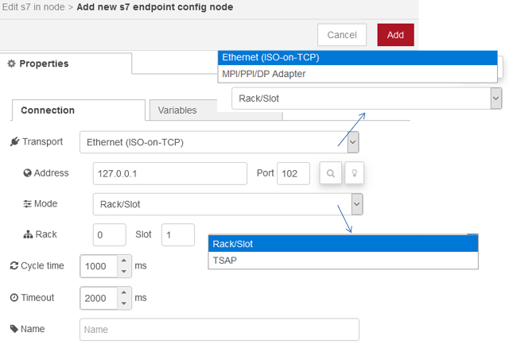
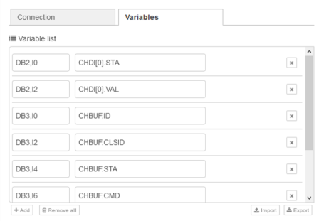
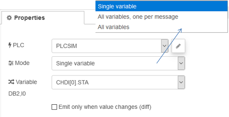
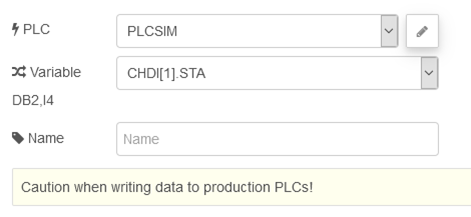
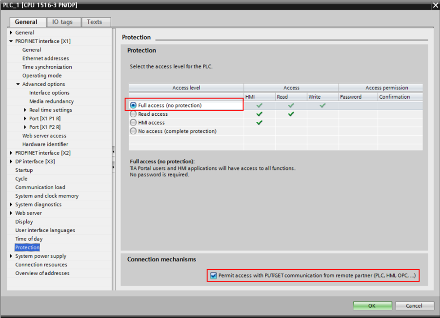
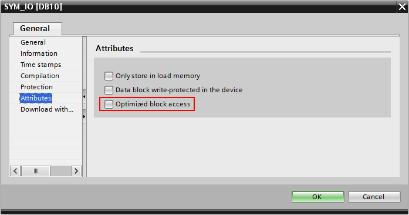

# node-red-contrib-s7 

https://flows.nodered.org/node/node-red-contrib-s7

## **S7 Endpoint**

### Connection

Кожне підключення до ПЛК представлено вузлом налаштування **S7 Endpoint**. Ви можете налаштувати адресу PLC, доступні змінні та їх адреси, а також час циклу зчитування змінних.

### Variables

Змінні та їх адреси, налаштовані на **S7 Endpoint**, дотримуються дещо іншої схеми, ніж Step 7 або TIA Portal. Ось кілька прикладів, які можуть допомогти вам у вирішенні змінних:

| Address                     | Step7 equivalent | JS Data type | Description                                            |
| --------------------------- | ---------------- | ------------ | ------------------------------------------------------ |
| `DB5,X0.1`                  | `DB5.DBX0.1`     | Boolean      | Bit 1 of byte 0 of DB 5                                |
| `DB23,B1` or `DB23,BYTE1`   | `DB23.DBB1`      | Number       | Byte 1 (0-255) of DB 23                                |
| `DB100,C2` or `DB100,CHAR2` | `DB100.DBB2`     | String       | Byte 2 of DB 100 as a Char                             |
| `DB42,I3` or `DB42,INT3`    | `DB42.DBW3`      | Number       | Signed 16-bit number at byte 3 of DB 42                |
| `DB57,WORD4`                | `DB57.DBW4`      | Number       | Unsigned 16-bit number at byte 4 of DB 57              |
| `DB13,DI5` or `DB13,DINT5`  | `DB13.DBD5`      | Number       | Signed 32-bit number at byte 5 of DB 13                |
| `DB19,DW6` or `DB19,DWORD6` | `DB19.DBD6`      | Number       | Unsigned 32-bit number at byte 6 of DB 19              |
| `DB21,R7` or `DB21,REAL7`   | `DB21.DBD7`      | Number       | Floating point 32-bit number at byte 7 of DB 21        |
| `DB2,S7.10`*                | -                | String       | String of length 10 starting at byte 7 of DB 2         |
| `I1.0` or `E1.0`            | `I1.0` or `E1.0` | Boolean      | Bit 0 of byte 1 of input area                          |
| `Q2.1` or `A2.1`            | `Q2.1` or `A2.1` | Boolean      | Bit 1 of byte 2 of output area                         |
| `M3.2`                      | `QM3.2`          | Boolean      | Bit 2 of byte 3 of memory area                         |
| `IB4` or `EB4`              | `IB4` or `EB4`   | Number       | Byte 4 (0 -255) of input area                          |
| `QB5` or `AB5`              | `QB5` or `AB5`   | Number       | Byte 5 (0 -255) of output area                         |
| `MB6`                       | `MB6`            | Number       | Byte 6 (0 -255) of memory area                         |
| `IC7` or `EC7`              | `IB7` or `EB7`   | String       | Byte 7 of input area as a Char                         |
| `QC8` or `AC8`              | `QB8` or `AB8`   | String       | Byte 8 of output area as a Char                        |
| `MC9`                       | `MB9`            | String       | Byte 9 of memory area as a Char                        |
| `II10` or `EI10`            | `IW10` or `EW10` | Number       | Signed 16-bit number at byte 10 of input area          |
| `QI12` or `AI12`            | `QW12` or `AW12` | Number       | Signed 16-bit number at byte 12 of output area         |
| `MI14`                      | `MW14`           | Number       | Signed 16-bit number at byte 14 of memory area         |
| `IW16` or `EW16`            | `IW16` or `EW16` | Number       | Unsigned 16-bit number at byte 16 of input area        |
| `QW18` or `AW18`            | `QW18` or `AW18` | Number       | Unsigned 16-bit number at byte 18 of output area       |
| `MW20`                      | `MW20`           | Number       | Unsigned 16-bit number at byte 20 of memory area       |
| `IDI22` or `EDI22`          | `ID22` or `ED22` | Number       | Signed 32-bit number at byte 22 of input area          |
| `QDI24` or `ADI24`          | `QD24` or `AD24` | Number       | Signed 32-bit number at byte 24 of output area         |
| `MDI26`                     | `MD26`           | Number       | Signed 32-bit number at byte 26 of memory area         |
| `ID28` or `ED28`            | `ID28` or `ED28` | Number       | Unsigned 32-bit number at byte 28 of input area        |
| `QD30` or `AD30`            | `QD30` or `AD30` | Number       | Unsigned 32-bit number at byte 30 of output area       |
| `MD32`                      | `MD32`           | Number       | Unsigned 32-bit number at byte 32 of memory area       |
| `IR34` or `ER34`            | `IR34` or `ER34` | Number       | Floating point 32-bit number at byte 34 of input area  |
| `QR36` or `AR36`            | `QR36` or `AR36` | Number       | Floating point 32-bit number at byte 36 of output area |
| `MR38`                      | `MR38`           | Number       | Floating point 32-bit number at byte 38 of memory area |
| `DB1,DT0`                   | -                | Date**       | A timestamp in the DATE_AND_TIME format                |
| `DB1,DTZ10`                 | -                | Date**       | A timestamp in the DATE_AND_TIME format, in UTC        |
| `DB2,DTL2`                  | -                | Date**       | A timestamp in the DTL format                          |
| `DB2,DTLZ12`                | -                | Date**       | A timestamp in the DTL format, in UTC                  |
| DB1,REAL0.20                |                  |              | Array of 20 values in DB1                              |
| DB1,X14.0.8                 |                  |              | Array of 8 bits in a data block                        |

- *) Зверніть увагу, що string на PLC використовують 2 додаткові байти на початку для розміру/довжини рядка
- **) Зверніть увагу, що `Date` у javascript *завжди* представлена в UTC. Будь ласка, використовуйте інші вузли, такі як [node-red-contrib-moment](https://flows.nodered.org/node/node-red-contrib-moment), щоб правильно обробляти перетворення типів

Бібліотека базується на [plcpeople/nodeS7](https://github.com/plcpeople/nodes7), там є додаткова інформація.

## S7-in

Вузол **S7 In** робить значення змінної доступними в потоці в трьох різних режимах:

-   **Single variable:** З налаштованих змінних можна вибрати одну змінну, і повідомлення надсилається кожен цикл, або лише тоді, коли вона змінюється, якщо встановлено *diff*. Властивість `msg.payload` містить значення змінної, а ` msg.topic` містить ім'я змінної.
-   **All variables, one per message:** Як і режим *Single variable*, але налаштовано для всіх змінних. Якщо позначено *diff*, повідомлення надсилається щоразу, коли будь-яка змінна змінюється. Якщо позначку *diff* не встановлено, для кожної змінної в кожному циклі надсилається одне повідомлення. Слід бути обережним щодо кількості повідомлень у секунду в цьому режимі.
-   **All variables:** У цьому режимі `msg.payload` містить об'єкт із усіма налаштованими змінними та їх значеннями. Якщо вказано *diff*, надсилається повідомлення, якщо хоча б одна зі змінних змінює своє значення.

## S7-out

Записує в область пам'яті в S7 PLC Цей вузол був створений як частина проекту [ST-One](https://st-one.io)

**Обережно при записі даних у виробничі ПЛК!**
Повністю протестуйте все, що робите. Автори не несуть відповідальності за будь-які збитки або травми, спричинені використанням цього вузла.

Входи:

- payload (string | number | boolean | array) - дані, які потрібно записати. Він буде перетворений до необхідного типу даних, коли це можливо.
- variable (string | array) - змінна для запису на ПЛК, відповідно до списку змінних на PLC endpoint. Це набуває чинності *лише*, якщо поле "Variable" залишається пустим у конфігурації.

Записує дані в PLC у змінну, вказану в конфігурації вузла, або на `msg.variable`. Можна одночасно записати до кількох змінних, встановивши і `msgvariable`, і `msg.payload` як масиви, що містять імена змінних та їх значення відповідно. Зверніть увагу, що вони можуть бути не записані в один і той же цикл запису в ПЛК, залежно від кількості змінних, які слід записати.

## S7 Control

Дозволяє розширене керування ПЛК та з'єднання. Цей вузол був створений в рамках проекту [ST-One](https://st-one.io).

Поведінка цього вузла змінюється відповідно до обраної функції. Кожна функція має власну конфігурацію, очікує різних параметрів у повідомленнях і надсилає різні повідомлення.

**Cycle Time** 	 		

Змінює інтервал часу між кожним циклічним зчитуванням змінних. Він очікує повідомлення з `payload` із додатним числом, що відповідає часу в мілісекундах між кожним читанням. Значення нуля відключає циклічне зчитування.

**Trigger read** 	 		

Вручну запускає цикл читання. Параметри повідомлення не використовуються, і те саме повідомлення надсилається на вихід. Корисно, коли використовується довший час циклу, але потрібен миттєвий зворотний зв'язок (наприклад, після зміни змінної). Зверніть увагу, що вузли *s7 in* все ще необхідні для зчитування значень змінних.

## Примітки щодо використання в S7-1200/1500

Ці новіші ПЛК пропонують «розширену» версію протоколу S7, тоді як у нас є лише «базова» версія. Тому необхідні деякі додаткові кроки налаштування на ПЛК:

- "Optimized block access" повинен бути відключений для БД, до яких ми хочемо отримати доступ 

- У розділі "Protection" властивостей процесора встановіть прапорець "Permit access with PUT/GET" 

## Bugs and enhancements

Please share your ideas and experiences on the [Node-RED forum](https://discourse.nodered.org/), or open an issue on the [page of the project on GitHub](https://github.com/st-one-io/node-red-contrib-s7)